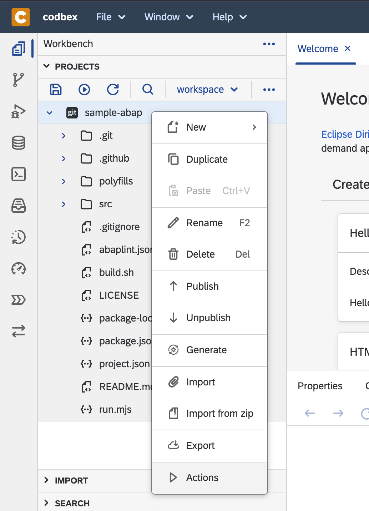
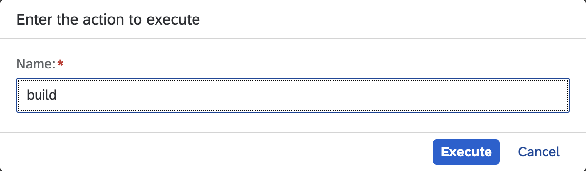
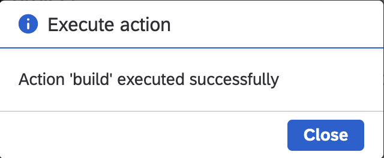

# sample-abap
ABAP sample backed by open-abap

Prerequisites: [NodeJs](https://nodejs.org/) 16+

## Running unit tests
1. `npm install`
2. `npm test`

Transpiled javascript files are located in folder `output`

## Running in Dirigible
1. Select project, right click -> `Actions`

2. Select `build` -> Execute and wait until it finishes successfully

3. Refresh workspace - should appear `dist` folder with a single `run.js` file in it

4. Publish project

5. Select run.mjs from the `dist` folder and see `hello world` prinited in the console

You can change the ABAP source file `src/zcl_hello_world.clas.abap` and repeate the steps above.

